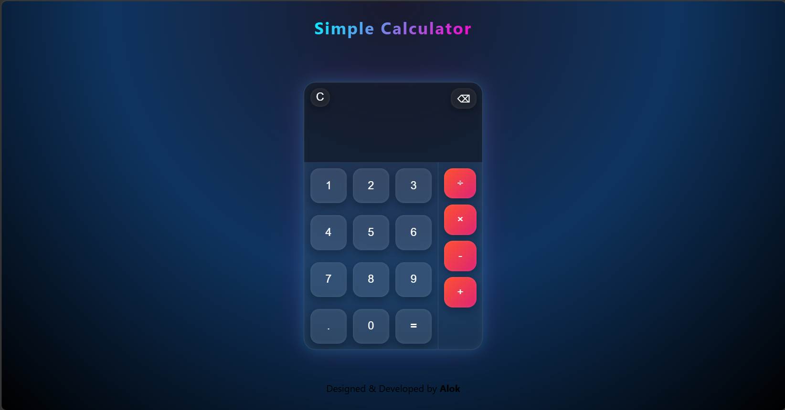

# 🧮 Calculator Project

A simple, responsive calculator built using HTML, CSS, and JavaScript.  
It supports basic arithmetic operations and keyboard input for a smooth user experience.

---

## 🚀 Features

- Addition, Subtraction, Multiplication, Division  
- Keyboard support (Enter, Backspace, Escape, etc.)  
- Clean and responsive UI  
- Real-time expression display  
- Clear and delete functionality  
- Handles both button clicks and keyboard input  

---

## 🛠️ Technologies Used

- HTML5  
- CSS3  
- JavaScript (Vanilla JS)  

---

## 📸 Preview

---

## 🎮 How to Use

1. Clone this repository:  
git clone https://github.com/alokmohapatra5513-dev/calculator.git  

2. Open the project folder:  
cd calculator  

3. Open `index.html` in your browser  

---

## ⌨️ Keyboard Controls

| Key        | Action            |
|------------|------------------|
| 0–9        | Input numbers    |
| + -        | Add/Subtract     |
| *          | Multiply         |
| /          | Divide           |
| Enter =    | Calculate result |
| Backspace  | Delete last char |
| Escape     | Clear all        |

---

## 📂 Project Structure

calculator/  
│── index.html  
│── style.css  
│── script.js  
│── README.md  

---

## 📌 Future Improvements

- Add dark/light mode 🌙  
- Add scientific calculator features  
- Improve UI animations  
- Prevent invalid expressions  

---

## 👨‍💻 Author

Alok  
GitHub: https://github.com/alokmohapatra5513-dev  

---

## ⭐ Support

If you like this project, give it a ⭐ on GitHub!